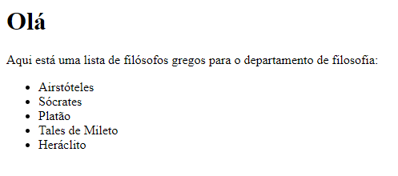
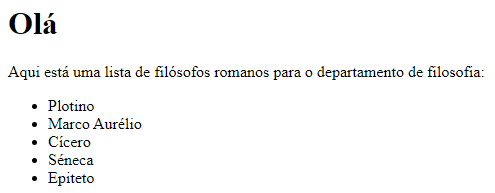
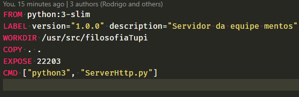
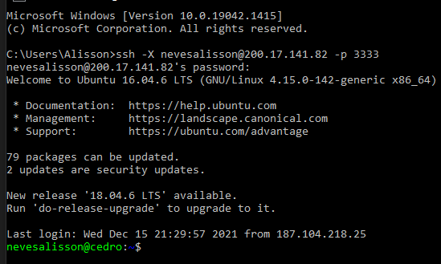
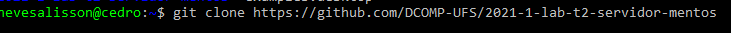
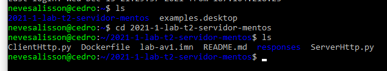
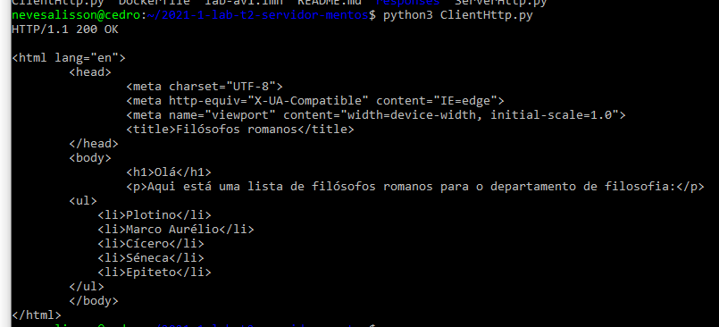

# HTTP Tupi - Solução para filósofos históricos.

## Autores

ALISSON OLIVEIRA NEVES: nevesalisson - Departamento de Filosofia

PEDRO AILAN SILVA DE OLIVEIRA: pedroailan - Departamento de Filosofia

RODRIGO FONTES MARTINS: rodrigo-fm - Departamento de geografia

## Descrição da solução desenvolvida

* Descreva qual problema prático sua aplicação resolve. Defina qual o tipo de usuário da aplicação

> Os alunos do departamento de filosofia desejam obter uma página específica na web contendo informações de filósofos gregos ou romanos.

* Se definiu um novo protocolo ou extensão então descreva qual o modelo de programação (se Cliente-servidor ou Peer-to-pee). Também descreva as mensagens do protocolo e formato das respostas

> Modelo cliente servidor onde o servidor retorna uma página web para exibição de resultados.
> A extensão do protocolo HTTP 1.1 foi feita com a adição de um campo de cabeçalho chamado "filosofos", "clima" e "civilizacao" que aceita dois possíveis valores, "filosofos": "gregos" ou "romanos", clima: "tropical" ou "semiarido", "civilizacao": "egipicia" ou "maia". As imagens abaixo mostram exemplos de respostas do servidor com os respectivos valores especificados para o cabeçalho "filosofos":
>
> Gregos:
> 
>
> Romanos:
> 
>
> Egipicia:
> 
>
> Maia:
> 
> Caso o cabeçalho "filosofos", "civilizacao" ou "clima" não seja especificado na requisição, o servidor retornará uma página HTML padrão:
> 
> 
> 
> OBS: Utilizamos a porta 22203 no ambiente cedro e a porta 12000 no ambiente interno do contêiner.

## Documentação de Implantação

### Descreva todo o processo de configuração do container

> A configuração do container se dá no arquivo dockerfile:
>
> 
>
> "FROM": Imagem base para a construção da nossa imagem, neste caso a imagem utilizada é a python3-sim.
> "LABEL": A versão da imagem e a descrição do projeto de servidor 1.0 da equipe mentos.
> "WORKDIR": A pasta virtual onde haverá a componetização do código de servidor.
> "COPY": O diretório dos arquivos que serão copiados para o servidor.
> "EXPOSE": A porta externa de acesso, nesse caso, a porta 22203.
> "CMD": Os comandos necessários para iniciar a imagem, neste caso é o comando "python3" seguido do argumento "ServidorHttp.py"
>
> Após a configuração do Dockerfile, é necessário realizar os seguintes comandos no diretório do Dockerfile em sequência:
>
> 1) docker build -t servidor-mentos .
> 2) docker run -d -p 22203:12000 -it --rm --name mentos-container servidor-mentos
>
> Após o feito, o docker estará rodando a aplicação de servidor.

### Descreva como o software pode ser testado em Cedro

> 1) Inicialmente deve-se conectar ao Cedro com o protocolo SSH.
>
> 
>
> 2) Realizar um clone no projeto para poder acessar os arquivos e pastas.
>
>    
>
>    Após realizar o clone, verá que já vai haver o arquivo do cliente e servidor.
>
>    
> 3) Rodar o arquivo "ClientHttp.py" utilizando python3.
>
>    
> 4) Pronto! Já podemos ver o retorno obtido de rodar o cliente python se comunicando bia protocolo HTTP Tupi.
